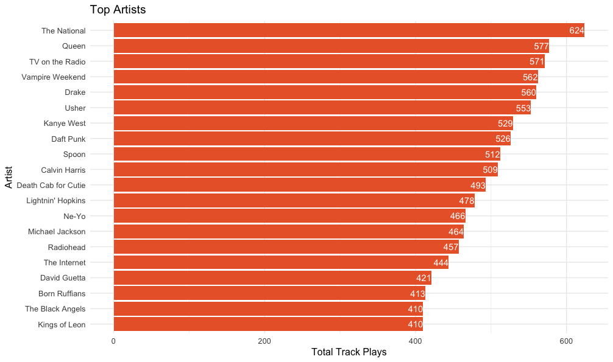

Music tastes are as varied from person to the next. I don't know why I like a lot of the music I do (a good subject for a future analysis).
The music we listen to in the space of a day can sometimes be very varied....or not. This is an analysis into the music habits of Blueflag/BigDatr employees.

The main questions this analysis is seeking to answer is:
- What are the most popular songs we have played?
- Who are the most popular artists?
- What genres do we listen to the most? What country of origin do we listen to the most? What time period is most popular?
- What is the mood of the songs being played? What is the most dominant mood? What is a playlist of songs to fit a mood?
- Does the weather have an impact on what music we play?

